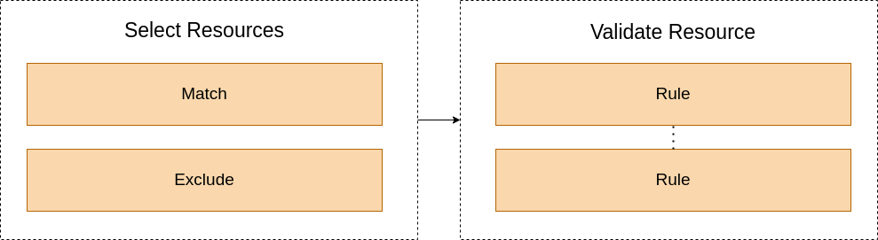

# Concepts

## Policy Structure



## Expression

Expressions are used to programmatically generate dynamic values.

An expression can be any combination of literal values, [contexts](contexts.md), or [functions](functions.md).

Expressions can be used anywhere in the policies and it uses [Golang template](https://pkg.go.dev/text/template) syntax with delims `${`, `}`

#### Examples

- Evaluate context

```
${ .Params.my_parameter }

```
> See [Contexts](contexts.md) for more information


- Evaluate context and functions 


```
${ .Params.my_parameter | upper }

```

> See [Functions](functions.md) for more information


- Evaluate string, context and functions 

```
directory: ${ index (split .Params.path "/") 0 }
```

## Condition

Condition is the main component in `yapl` policy and it is re-used everywhere in the policy.

| Field         | Type     |  Notes     |         Description                                                                                                 |
|---------------|----------|------------|-------------------------------------------------------------------------------------------------------------------  |
|  `field`      | `string` | *required* | The json path of the field to evaluate.                                                                             |
|  `expr`       | `string` | *optional* | [Expression](#expression) to evaluate. If provided condition will compare its value instead of `field`'s value.     |
|  `operator`   | `string` | *required* | condition's operator. Available operators are [here](operators.md).                                                 |
|  `value`      |  `any`   | *required* | value to compare `field`'s or `expr`'s' value with.                                                                 |


#### Examples

- The following example checks if field `metadata.namespace` is equals `default` or not.

```yaml
field: metadata.namespace
operator: equal
value: default
```

- To check a field in arrays you can use `[<index>]` to access the array index or use `[*]` to evaluate all items in the array

Check only first container

```yaml
field: spec.containers[0].name
operator: hasPrefix
value: container-
```

Check all containers

```yaml
field: spec.containers[*].name
operator: hasPrefix
value: container-
```

- `expr` field can be used to do some changes to the value of the field before the condition evaluation. For example:

```yaml
field: metadata.namespace
expr: ${ .Cond.Field.Value | upper }
operator: equal
value: DEFAUT
```

## Logical Condition

Logical condition combine the result of multiple [conditions](#condition) to produce a single result.

Logical operators `and`, `or` and `not` are used to define the relationship of conditions. Logical condition can has multiple levels.

#### Examples

```yaml
  and:
  - < condition >
  - < condition >
```

```yaml
  or:
  - < condition >
  - < condition >
```

```yaml
  not:
    < condition >
```

```yaml
  and:
  - < condition >
  - < condition >
  - or:
    - < condition >
    - < condition >
    - not:
        < condition >
```
